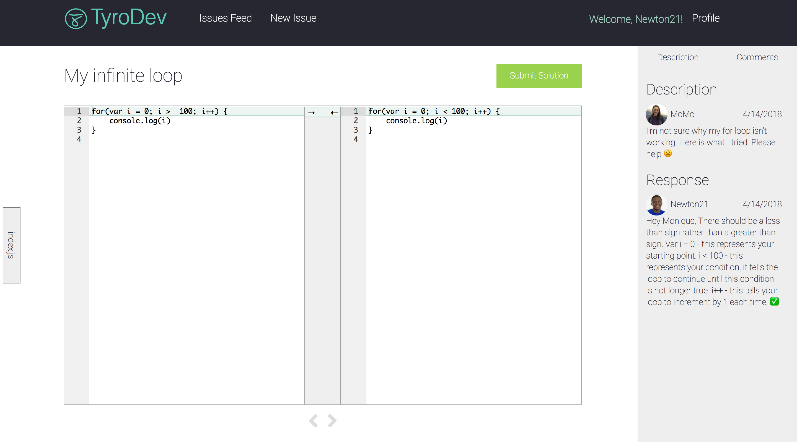

# TyroDev
TyroDev is a developer tool that displays side by side editors to allow new developers to easily find solutions to their code issues.


## The Problem
There isn't a good platform for new developers to get help with code issues and explain abstract concepts visually. 

## Why is TyroDev a Solution?
-   Easy to use interface, you can login and create an account.
    
-   Users can upload files from your computer or from your Github Repository
    
-   Side by Side editors to easily show the difference
    
- A non hostile environment for new devs to ask questions

## Getting Started
We're working on hosting TyroDev, in the meantime,  run the following commands in your terminal: 
```
git clone git@github.com:simongaviria1/capstone-team4.git
cd capstone-team4/backend
npm install
npm start
[Command + T] (makes a new tab in your terminal)
cd ../frontend
npm install
npm start
```
## Built With
 - [react](https://reactjs.org/) - JavaScript Library
 - HTML/CSS
- [github embed](https://github.com/finom/github-embed) 


## Contributors
[Newton Brooks](https://github.com/newton-brooks) - Scrum Master
[Elon Jefferson](https://github.com/Edje-C) - UX/UI Lead
[Monique Mojica](https://github.com/mon33k) - Project Manager
[Simon Garvaria](https://github.com/simongaviria1) - Technical Lead
[Carlo Valenti](https://github.com/cval-c4q) - Demo Lead


## Fun Facts
- This project was built over one month for our Coalition for Queens (C4Q) capstone project in March of 2018.
-  The definition of tyro is, a beginner or novice.


